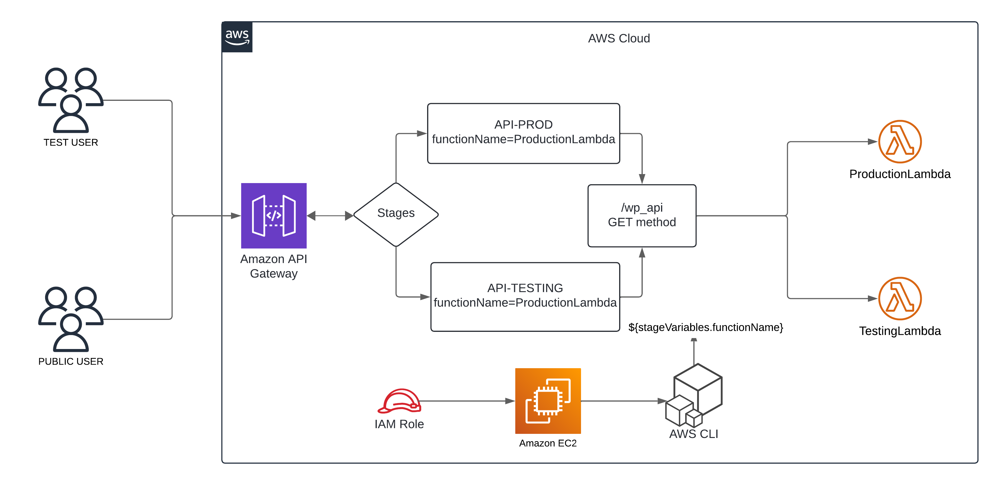

# AWS API Gateway with Stage Variables  

## Overview  
This project demonstrates how to set up an **AWS API Gateway** with multiple stages (**Testing** and **Production**) using **stage variables**. By leveraging AWS Lambda and API Gateway, we enable dynamic function invocation without modifying the API Gateway configuration directly.  

## Objectives  
✔ Deploy an API Gateway with **Testing** and **Production** stages.  
✔ Use **stage variables** to dynamically invoke the correct Lambda function.  
✔ Securely configure API Gateway permissions using AWS CLI.  
✔ Deploy Lambda functions efficiently for different environments.  
 
##  Steps to Implement  

### 1 AWS Setup  
- Sign in to AWS Console  
- Configure IAM roles and permissions → [Policies](policies)

### 2 Launch EC2 Instance  
- Setup an Amazon Linux 2 EC2 instance  
- Configure SSH and install AWS CLI  

### 3 Create Lambda Functions  
- Implement `ProductionLambda`  
- Implement `TestingLambda`  

### 4 Set Up API Gateway  
- Create an API
- Define resources and methods  

### 5 Assign Permissions via CLI  
- Grant API Gateway permission to invoke Lambda  

### 6 Deploy API Gateway Stages  
- Create `API-PROD` and `API-TESTING` stages  

### 7 Configure Stage Variables  
- Assign Lambda functions to respective stages  

### 8 Testing and Validation  
- Perform API calls to verify the setup  

## Documentation  
- [Deployment Guide](guide.md)  
- [API Gateway Setup](api_gateway_setup.md)  

## Use Cases  
This setup is useful for:  

✔ **CI/CD Pipelines** – Easily test API changes in a **Testing** stage before deploying to **Production**.  
✔ **Multi-Environment APIs** – Maintain different API behaviors for development and production.  
✔ **A/B Testing** – Route traffic dynamically to different Lambda versions based on the API stage.  
✔ **Cost Optimization** – Reduce Lambda execution costs by directing test traffic to a separate function.  

##  Requirements  
- AWS Account  
- AWS CLI installed  
- Basic knowledge of AWS services  

