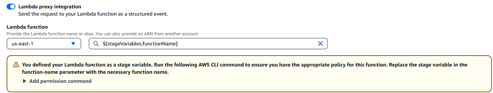
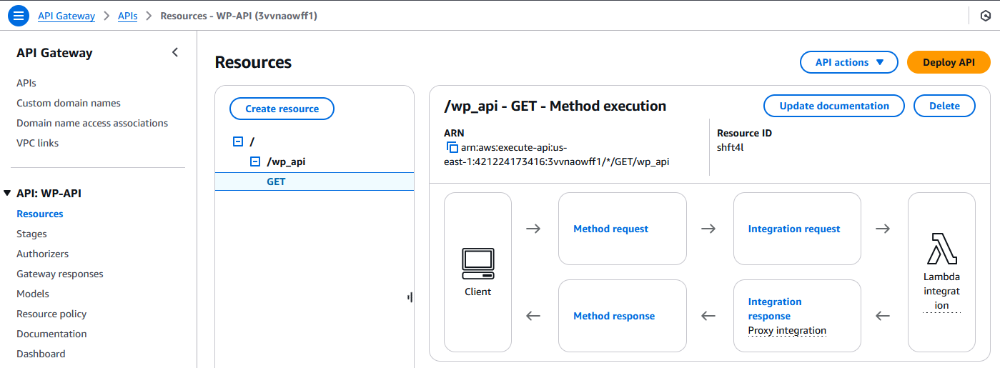
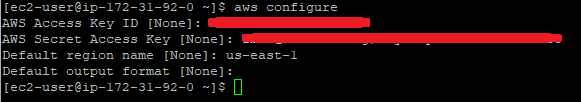
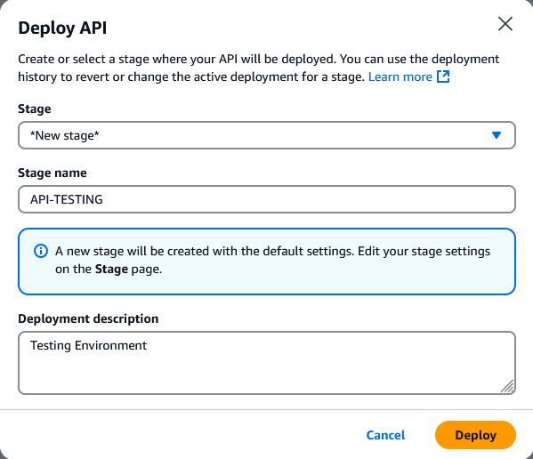
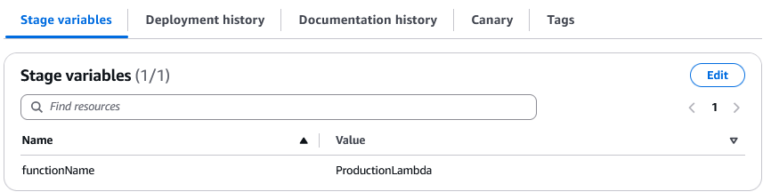

# API Gateway Setup Guide  

This guide provides the principal steps to configure **AWS API Gateway** and integrate it with Lambda using stage variables.  

---

## Step 1: Create an API Gateway  
1. Go to **AWS Console** → **API Gateway** (`Services` → `API Gateway`).  
2. Click **Build** under **REST API**.  
3. Choose:  
   - **Protocol**: `REST`  
   - **Create new API**: `New API`  
   - **API Name**: `WP-API`  
4. Click **Create API**.  


## Step 2: Create a Resource  
1. Select your **API Name** in API Gateway.  
2. Click **Create Resource**.  
3. Enter:  
   - **Resource Name**: `wp_api`  
4. Click **Create Resource**.  


## Step 3: Create a Method  
1. Select **wp_api**.  
2. Click **Create Method** → Select **GET** from the dropdown.  
3. Configure:  
   - **Integration Type**: `Lambda Function`  
   - **Use Lambda Proxy integration**: ✅ (Check the box)  
   - **Lambda Region**: `us-east-1`  
   - **Lambda Function Name**: `${stageVariables.functionName}`


   
4. Click **Save** and copy the **Source-ARN**.  




## Step 4: Grant API Gateway Permission to Lambda  

In this step, we are going to run the CLI command to give lambda permissions to the API using the EC2 instance

1. **Connect to your EC2 instance** via SSH.  
2. Configure AWS CLI:
    
   ```sh
   aws configure
   ```
   * Enter **Access Key ID, Secret Access Key**, and set Region to `us-east-1`



3. Run the following command to grant permissions to **ProductionLambda and TestingLambda**:
   
   ```
   # Grant permission to ProductionLambda

   aws lambda add-permission --function-name "arn:aws:lambda:us-east-1:XXXXXXXXXXXX:function:ProductionLambda" \
   --source-arn "arn:aws:execute-api:us-east-1:XXXXXXXXXXXX:YOUR_API_ID/*/GET/wp_api" \
   --principal apigateway.amazonaws.com \
   --statement-id "APIInvokePermission_Production" \
   --action lambda:InvokeFunction --region us-east-1

   # Grant permission to TestingLambda

   aws lambda add-permission --function-name "arn:aws:lambda:us-east-1:XXXXXXXXXXXX:function:TestingLambda" \
   --source-arn "arn:aws:execute-api:us-east-1:XXXXXXXXXXXX:YOUR_API_ID/*/GET/wp_api" \
   --principal apigateway.amazonaws.com \
   --statement-id "APIInvokePermission_Testing" \
   --action lambda:InvokeFunction --region us-east-1
   ```
## Step 5: Deploy API Gateway with Stages

1. Click Actions → Deploy API.
2. Select **Stage** → `New Stage`
-   **Stage Name**: `API-TESTING`
-   **Description**: `Testing Environment`
3. Click Deploy.

   * Repeat the same steps for API-PROD



## Step 6: Configure Stage Variables

Add Variable to API-PROD Stage

1. Select API-PROD → Stage Variables tab.
2. Click Edit → Add Stage Variable:
-   **Name:** functionName
-   **Value:** ProductionLambda
3. Click **Save**

   * Repeat the same steps for API-TESTING



## [TEST API](https://github.com/wperalta28/aws-api-gateway-stages_test/blob/main/guide.md#step-5-test-api)

---

