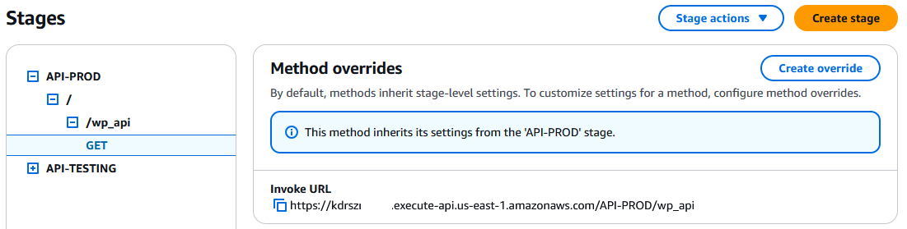
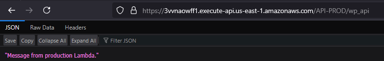

# Deployment Guide  

## Step 1: Set Up AWS Environment  
Before deploying the API Gateway and Lambda functions, ensure you have access to an AWS account and the required IAM permissions.  

### 1.1 Sign in to AWS Console  
1. Go to [AWS Management Console](https://aws.amazon.com/console/).  
2. Sign in using your IAM credentials.  
3. Set the **default region** to **US East (N. Virginia) `us-east-1`**.  

### 1.2 Launch an EC2 Instance  
1. Navigate to **EC2** (`Services` → `EC2`).  
2. Click **Launch Instance** and configure the following:  
   - **Name**: `EC2InstanceTest`  
   - **AMI**: `Amazon Linux 2 AMI`  
   - **Instance Type**: `t2.micro`  
   - **Key Pair**: Create a new key pair (`MyKeyPair`) and download the `.pem` file.  
3. Under **Network Settings**, edit the following:  
   - Enable **Auto-assign Public IP**.  
   - Create a new **Security Group**:  
     - **Name**: `SG_EC2Server`  
     - Allow **SSH (Port 22) from Anywhere** (`0.0.0.0/0`).  
4. Under **Advanced Settings**, set **IAM Instance Profile** to `EC2_Lambda_Role`
5. Click **Launch Instance** and wait until the status is **Running**.  

### 1.3 Connect to EC2 Instance  
1. Check this [AWS Document](https://docs.aws.amazon.com/AWSEC2/latest/UserGuide/connect-linux-inst-from-windows.html#putty-private-key) 

---  

## Step 2: Configure AWS CLI
To interact with AWS services from the EC2 instance, you need to configure the AWS CLI.  

1. Run the following command:  
   ```sh  
   aws configure  
   ```  
2. Enter the required credentials:  
   - **Access Key ID**: _(Copy from AWS IAM)_  
   - **Secret Access Key**: _(Copy from AWS IAM)_  
   - **Default Region**: `us-east-1`  
   - **Output format**: `json`  

---  

## Step 3: Create Lambda Functions  
In this step, we create two Lambda functions: `ProductionLambda` and `TestingLambda`.  

### 3.1 Create `ProductionLambda`  
1. Navigate to **AWS Lambda** (`Services` → `Lambda`).  
2. Click **Create Function**.  
3. Configure:  
   - **Function Name**: `ProductionLambda`  
   - **Runtime**: `Python 3.9`  
   - **Execution Role**: `BasicLambdaRole` 
4. Click **Create Function**.  
5. Replace the function code with the following:  [production_lambda.py](lambda/production_lambda.py)
6. Click **Deploy** and copy the Function-ARN.  

### 3.2 Create `TestingLambda`  
1. Repeat **Steps 1-4** above but use:  
   - **Function Name**: `TestingLambda`  
   - **Execution Role**: `BasicLambdaRole`  
2. Function Code: [testing_lambda.py](lambda/testing_lambda.py)
3. Click **Deploy** and copy the Function-ARN.  
---  

## [Step 4: Configure API Gateway](api_gateway_setup.md)  

---  

## Step 5: Test API  

Now we are going to test the API Gateway by making GET requests to the endpoints associated with the deployed stages. This ensures that the API Gateway is properly integrated with the Lambda functions and functioning as expected.

1. Open the `API-PROD` stage → **GET Method**.


   
3. Copy the **Invoke URL** and open it in a browser.  
4. You should see: `Message from production Lambda.`


   
6. Repeat for `API-TESTING`.  

**Deployment Completed!**  

---  

